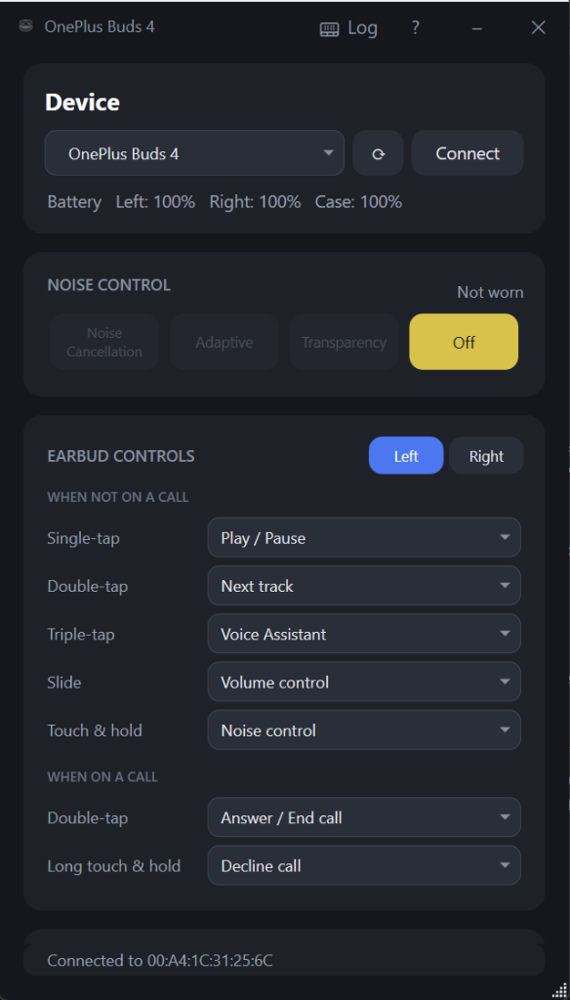
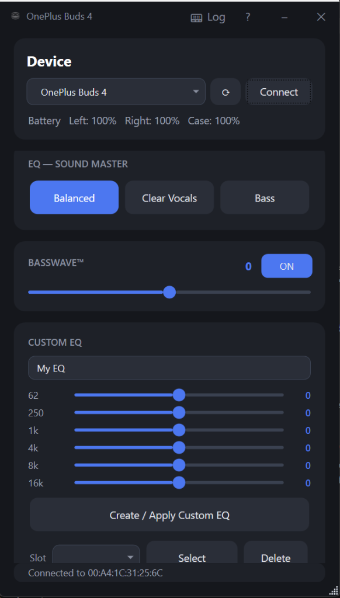

# OnePlus Buds — Windows Companion (.NET)

A native, lightweight Windows desktop companion application to control and monitor **OnePlus Buds** (OnePlus Buds 4 & OnePlus Buds Pro 3) earphones over Bluetooth Classic RFCOMM from a PC, without requiring the Android HeyMelody app.

Forked from [nic0manz/oneplus_buds3_pro_dotnet](https://github.com/nic0manz/oneplus_buds3_pro_dotnet) and maintained by [Thomaspatrick14](https://github.com/Thomaspatrick14/Oneplus-buds4-Win-Companion) with AI assistance.

---

## Screenshots

<p align="center">
  
  &nbsp;&nbsp;
  
</p>

---

## Features

- **Noise Control**:
  - Full mode switching: **Noise Cancellation**, **Adaptive**, **Transparency**, and **Off**.
  - Noise Cancellation level selection: **High**, **Moderate**, **Low**, and **Auto**.
- **Earbud Controls (Gestures)**:
  - Independent customization for **Left** and **Right** earbuds with quick-switch tabs.
  - **Media Controls (When not on a call)**:
    - **Single-tap**: `Play / Pause`, `None`
    - **Double-tap**: `Next track`, `Previous track`, `Play / Pause`, `Voice Assistant`, `None`
    - **Triple-tap**: `Voice Assistant`, `Previous track`, `Next track`, `None`
    - **Slide**: `Volume control`, `None`
    - **Touch & hold**: `Noise control`, `Voice Assistant`, `None`
  - **Call Controls (When on a call)**:
    - **Double-tap**: `Answer / End call`, `None`
    - **Long touch & hold**: `Decline call`, `None`
  - Full two-way live synchronization: changes made in the app reflect immediately on the earbuds and the official HeyMelody mobile app, and vice versa.
- **Sound Master EQ**:
  - Direct preset switching: **Balanced**, **Clear Vocals**, and **Bass**.
- **BassWave™**:
  - Dynamic bass enhancement toggle with continuous adjustment slider (−5 to +5).
- **Custom 6-Band EQ**:
  - Interactive 6-band equalizer (62 Hz, 250 Hz, 1 kHz, 4 kHz, 8 kHz, 16 kHz).
  - Create, apply, select, and delete custom profiles saved directly into the earbuds' flash memory.
- **Live Bluetooth Packet Monitor**:
  - Built-in live RFCOMM packet sniffer (`Log` button in the title bar).
  - Inspect incoming notifications and outgoing commands in real time with hex decoding, filtering, and custom packet transmission.
- **Dual Connection**:
  - Fully supports Dual Connection mode (connects to your PC and smartphone simultaneously).
- **In-Ear Optical Wear Detection**:
  - Real-time wear status (`Worn` / `Not worn`). Noise control automatically locks when earbuds are removed from ears.
- **Live Battery Levels**:
  - Battery percentage display for Left earbud, Right earbud, and Charging Case.
- **Auto-Connect & Auto-Reconnect**:
  - Automatically detects paired OnePlus Buds 4 devices on launch and reconnects silently.
- **System Tray**:
  - Minimizes cleanly to the Windows notification tray with balloon tips and quick restoration on double-click.

---

## Requirements

- Windows 10 / Windows 11 (64-bit)
- [.NET 8 Desktop Runtime](https://dotnet.microsoft.com/en-us/download/dotnet/8.0)
- OnePlus Buds 4 paired via Windows Bluetooth Settings

---

## Usage

1. Pair your **OnePlus Buds 4** in Windows Bluetooth settings (`Settings` → `Bluetooth & devices` → `Add device`).
2. Run `OnePlusBuds4.exe`.
3. The app will automatically find the paired device and establish connection.
4. If auto-detection does not pick your device, select it from the dropdown or paste its Bluetooth MAC address manually and click **Connect**.

---

## How It Works

The OnePlus Buds 4 expose their proprietary control protocol over **Bluetooth Classic RFCOMM, channel 15** — the same serial communication channel utilized by the official HeyMelody app on Android.

### Dual Connection & Handshake

The application opens an `AF_BTH` socket directly to the earphone's Bluetooth MAC address without requiring Windows GATT or WinRT abstractions:
1. `HELLO` handshake (`AA 07 00 00 00 01 23 00 00 12`)
2. `REGISTER` handshake (`AA 0C 00 00 00 85 41 05 00 00 B5 50 A0 69`)
3. Full state interrogation query (ANC, EQ, BassWave, Gestures, Wear status, Custom EQ slots, and Battery).

Because OnePlus Buds 4 support multipoint Dual Connection, your smartphone can remain connected simultaneously.

### Live Push Protocol

A dedicated background listener continuously reads the socket stream. When an option is toggled—whether in this Windows application, on your phone's HeyMelody app, or via physical touch gestures on the stems—the earbuds **push** unsolicited notification packets (`0x02` / `0x05`), which update the UI in real time without polling. Battery level is queried periodically.

### Frame Format

Every frame in both directions adheres to the following binary structure:
```
AA <len> 00 00 <cmd_lo> <cmd_hi> <seq> <plen_lo> <plen_hi> [payload]
```
- `AA`: Start delimiter byte; `len`: Number of bytes following.
- `cmd16`: 16-bit little-endian function code.
- `cmd_hi`:
  - `0x01`: Request query · `0x81`: Reply to query
  - `0x04`: Set command · `0x84`: Set acknowledgement (status code: `0` = success)
  - `0x02` / `0x05`: Unsolicited live state push notification
- `seq`: Sequence counter.
- `plen`: Payload length (little-endian 16-bit).
- `payload`: Parameter-specific payload bytes.

### Protocol Reference

| Feature | Query (Cmd) | Set (Cmd) | Details |
|---|---|---|---|
| **Earbud Gestures** | `08 01` | `08 04` | 18 gesture mappings across Left & Right; sets `[side] [cat] [gid] [aid]` |
| **ANC Mode & Level** | `0C 01` | `0C 04` | Mode (ANC / Adaptive / Trans / Off) & Level (High / Mid / Low / Auto); pushed as `04 02` |
| **Sound Master EQ** | `0F 01` | `0F 04` | Balanced (`0x00`), Clear Vocals (`0x01`), Bass (`0x02`) |
| **BassWave™ Enable** | `0D 01` | `0D 04` | Feature Switch ID `0x1D` (Fn 269) |
| **BassWave™ Value** | `24 01` | `24 04` | Signed range (−5 to +5) |
| **Custom EQ Profiles** | `22 01` | `22 04` | Read, create, select, and delete 6-band user profiles |
| **In-Ear Wear Detection** | `09 01` | — | Optical sensor states (Left, Right, Case); pushed as `04 02` |
| **Battery Status** | `06 01` | — | Left, Right, and Case levels with charging flags |

---

## Building from Source

Prerequisites: [.NET 8 SDK](https://dotnet.microsoft.com/en-us/download/dotnet/8.0).

### Build Single-File Release Executable
```powershell
dotnet publish OnePlusBuds4/OnePlusBuds4.csproj -c Release -r win-x64 --self-contained false -p:PublishSingleFile=true -o out
```

The resulting standalone executable `OnePlusBuds4.exe` is generated in `out/`.

---

## Project Structure

```
OnePlusBuds4/
├── BudsConnection.cs        # RFCOMM socket, protocol framing, packet encoders & decoders
├── MainWindow.xaml          # Modern dark-theme WPF user interface
├── MainWindow.xaml.cs       # UI event dispatching, state synchronization & tray integration
├── PacketLogWindow.xaml     # Real-time Bluetooth RFCOMM packet monitor UI
├── PacketLogWindow.xaml.cs  # Live log capture, filtering, and custom packet transmitter
├── AboutWindow.xaml         # About modal and attribution
├── AboutWindow.xaml.cs      # About window logic
├── App.xaml / App.xaml.cs   # WPF Application entrypoint
└── app.ico                  # Multi-resolution application icon (16x16 to 256x256)
```

---

## Credits & Acknowledgments

- **Original Project**: Forked from [nic0manz/oneplus_buds3_pro_dotnet](https://github.com/nic0manz/oneplus_buds3_pro_dotnet) created by **Nico**.
- **Rewritten for OnePlus Buds 4**: Maintained and rewritten by **[Thomaspatrick14](https://github.com/Thomaspatrick14/Oneplus-buds4-Win-Companion)**.
- **AI Assistance**: Reverse engineering, protocol discovery, gesture implementation, and modern UI enhancements were developed with **AI assistance**.

---

## License

This project is licensed under the same open terms as the original repository. Provided for personal and educational use. Not affiliated with or endorsed by OnePlus or Oppo.
